# Projeto Health Insurance Cross Sell.

## O projeto

Este projeto fictício que compõe o meu portfólio profissional busca criar uma solução de negocio que auxiliará uma empresa de seguros de saúde a definir quais clientes devem ser selecionados para receberem uma oferta de lançamento de um novo produto.

O projeto está estruturado nos seguintes passos:

    1. Questão de negócio
    2. Premissas do projeto
    3. Planejamento da solução e os produtos propostos
    4. Insights obtidos com os dados
    5. Análise e resultados obtidos com o produto proposto
    6. Conclusão do projeto de portfólio
    7. Próximos passos para melhorar o produto

## 1 Questão de negócio

A HII, Health Insurance India, é uma empresa de seguros de saúde que possui milhares de clientes na Índia. O faturamento no último ano foi de mais de 142 milhões de dólares. No atual planejamento estratégico da empresa está previsto o lançamento de um novo produto, que corresponde a um seguro veicular. A diretoria espera com esse lançamento aumentar as receitas da empresa no próximo ano.

### 1.1 Qual o problema de negócio?

A empresa precisa definir a quais clientes deve oferecer um seguro veicular com condições especiais. A diretoria estabeleceu que a base de dados de clientes do ano anterior deveria ser utilizada como fonte de dados, pois uma pesquisa sobre intenção de contratação de seguros veicular foi realizada com esses segurados. Nessa pesquisa os clientes responderam algumas perguntas, tais como se tinham interesse ou não em contratar o seguro veicular, se já tiveram os seus veículos danificados no passado, bem como se os seus veículos já tinham seguro e qual a idade aproximada dos seus veículos.

Durante o planejamento estratégico foi definido que o time de vendas deveria oferecer esse novo produto na primeira fase por meio de contato telefônico. O time comercial da empresa somente consegue realizar 20 mil ligações por mês. Diante da importância desse projeto, o CEO solicitou que uma nova ferramenta fosse desenvolvida e que seja capaz de Rankear a partir de uma lista com 127 mil novos clientes quais deles são mais propensos a contratar o seguro veicular de acordo com as suas características.

### 1.2 Proposta de solução do problema

A partir dos dados históricos dos clientes e da pesquisa de intenção de contratação de seguro veicular, desenvolver um modelo de machine learning capaz de realizar a ordenação desses clientes tendo em vista a **maior probabilidade de contratação** do seguro.

## 2 Premissas do projeto

Esse projeto de portfólio foi elaborado utilizado os datasets de um dos ["hackthons"](https://www.kaggle.com/datasets/anmolkumar/health-insurance-cross-sell-prediction?select=train.csv) promovidos pela Analytics Vidhya e disponibilizados na plataforma do Kaggle Inc. Ressalta-se que nesse desafio foi disponibilizado um dataset de treino com mais de 380 mil de linhas e 10 features com informações sobre os históricos dos clientes do plano de saúde e sobre a pesquisa de contratação de seguro veicular. O conjunto de teste desse hackthon possui 127 mil linhas e todas as features, porém não possui a variável resposta.

Ressalta-se que esse hipotético projeto de portfólio foi elaborado segundo a experiência do autor e com base nos dados coletados no kaggle. Não sendo possível atestar sobre a veracidade dos dados do dataset e se os mesmos possuem conexão com o mercado.

## 3 Planejamento da solução

### 3.1 Produtos propostos

Será desenvolvido um modelo de machine learning capaz de rankear os clientes da base de dados de acordo com a maior probabilidade de responder positivamente a variável resposta do problema. O modelo treinado será capaz de ordenar os clientes da maior para a menor probabilidade. Sendo assim, o time comercial terá condições de abordar os 20 mil clientes mais prováveis de aceitarem uma proposta de seguro veicular com a utilização dessa ferramenta.

Posteriormente esse modelo será implementado no conjunto de teste com 127 mil linhas, onde não há informações sobre a variável resposta do problema, que corresponderia a novos clientes da empresa.

### 3.2 Ferramentas utilizadas

* Python Packages
* Jupyter Notebook

<table>
  <tbody>
    <tr valign="top">
      <td width="25%" align="center">
        Python  
        
      </td>
      <td width="25%" align="center">
        pandas  
        
      </td>
      <td width="25%" align="center">
        NumPy  
        
      </td>
      <td width="25%" align="center">
        SciPy  
        
      </td>
    </tr>
    <tr valign="top">
      <td width="25%" align="center">
        Matplotlib  
        
      </td>
      <td width="25%" align="center">
        seaborn  
        
      </td>
      <td width="25%" align="center">
        scikit-learn  
        
      </td>
      <td width="25%" align="center">
        XGBoost  
        
      </td>
    <tr valign="top">
    </tr>
    <tr valign="top">
    <td width="25%" align="center">
        CatBoost  
        
      </td>
      <td width="25%" align="center">
        Jupyter  
        
      </td>
      <td width="25%" align="center">
        LGBM  
        
      </td>
    </tr>
  </tbody>
</table>

### 3.3 Processo

O processo utilizado para resolução do problema de negócio segue a metodologia CRIPS-DM. O emprego dessa metodologia nos dá flexibilidade para entregar resultados rápidos e de forma cíclica.

Ao todo a execução da solução do projeto será dividida em 8 passos:

    1. Coleta e Descrição dos dados
    2. Feature engineering
    3. Análise exploratória dos dados
    4. Preparação dos dados
    5. Seleção de variáveis
    6. Machine Learning Modeling
    7. Hyper Parameter Fine Tunining
    8. Business Performance
    9. Ordenação do conjunto de teste - lista de novos clientes

## 4 Insights obtidos com os dados - modelo de machine learning

Um dos objetivos da Análise Exploratória de Dados ( EDA ) é perceber qual o impacto das variáveis no fenômeno de interesse. Além disso, também é importante perceber quais variáveis podem ser relevantes para o modelo de machine learning. Durante a etapa de EDA desse projeto observou-se alguns alguns insights interessantes no dataset.

***1. Clientes com interesse na contratação de seguros possuem mediana acima de 40 anos.***

 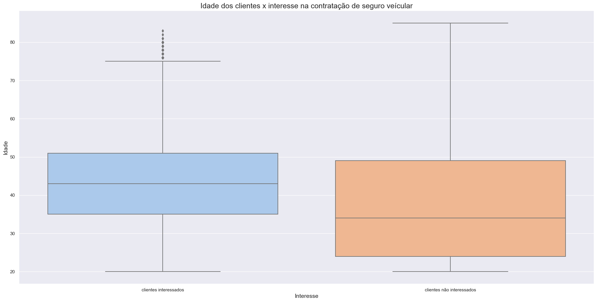 

***2. Dos clientes que tem interesse na contratação de seguros veiculares 61% são do sexo masculino.***

 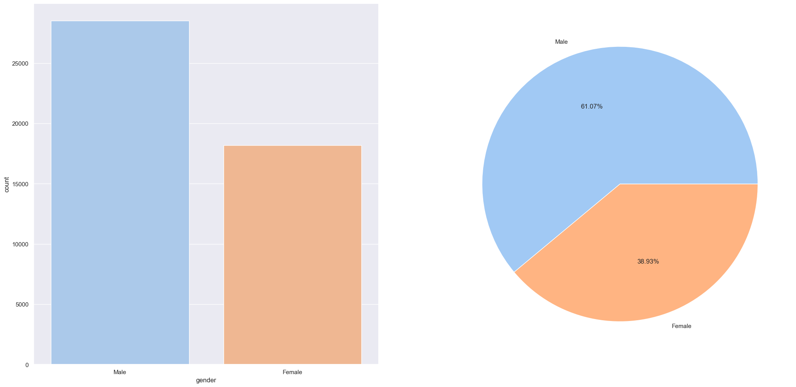 

***3. O tempo que o cliente possui seguro saúde não influencia no interesse da contratação de seguro veicular.***

 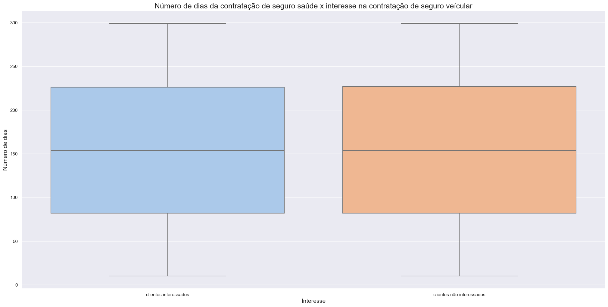 

***4. Idade do veículo do cliente vs Interesse na contratação de seguro veicular.***

 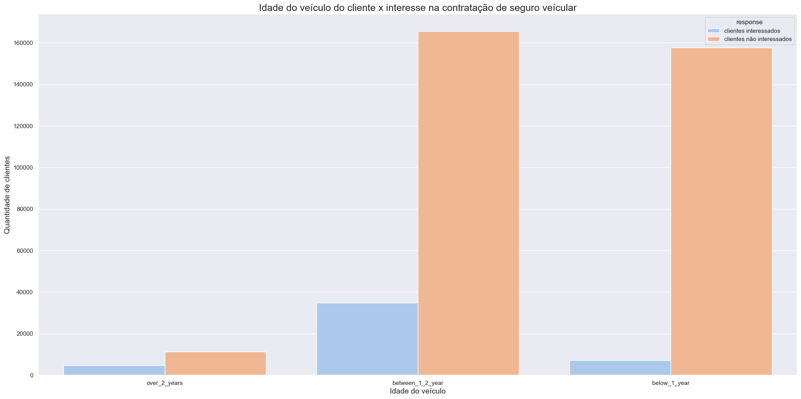 

* **17%** dos clientes que possuem veículos com **idade entre 1 e 2 anos** tem interesse na contração de seguro veicular (9% do total de clientes).
* **4 %**  dos clientes que possuem veículos com **idade abaixo de 1 ano** tem interesse na contração de seguro veicular (2% do total de clientes).
* **29%** dos clientes que possuem veículos com **idade acima de 2 anos** tem interesse na contração de seguro veicular  (1% do total de clientes).

***5. Regiões com mais de 15 % de clientes interessados na contratação de seguros veicular.***

 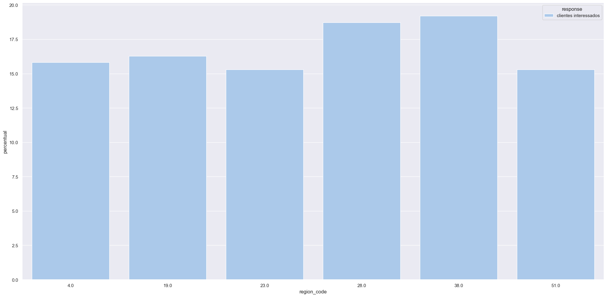 

***6. Clientes que possuem seguro veicular vs Clientes que não possuem seguro veicular.***

 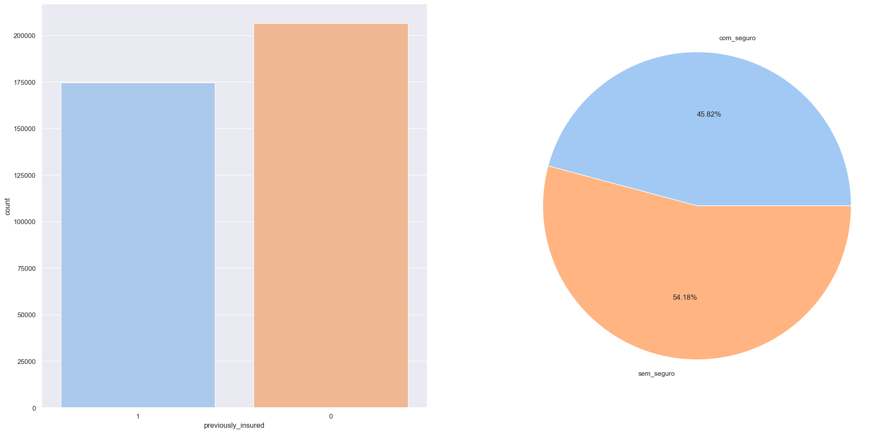 

* 45.82% dos clientes possuem seguro veicular (174628 clientes)
* 54.18% dos clientes não possuem seguro veicular (206481 clientes)

| Cliente / Interesse          | Sem interesse na contratação  | Com interesse na contratação | Total  de clientes  |
|   :----:                     |    :----:                     |           :----:             |  :----:             |
| Clientes com seguro veicular | 174470 (99.91%)               | 158 (0.09%)                  | 174628              |
| Clientes sem seguro veicular | 159929 (77.45%)               | 46552 (22.55%)               | 206481              |

* **99.91%** dos clientes que já possuem seguro veicular não tem interesse em contratar seguro veicular da Health Insurance India. (174470 clientes).

* Dos 206481 clientes que não possuem seguro veicular, apenas **22.55%** possem interesse em contratar o seguro veicular da Health Insurance India (46552 clientes).

## 5 Análise e resultados obtidos

### 5.1 Análise e resultados obtidos com o modelo

Neste projeto foram utilizados 8 diferentes modelos de machine learning para o rankeamento dos clientes na maior probabilidade de interesse na contratação de seguro veicular com base nos seus respectivos históricos. O valor k estabelecido para o rankeamento é 20 mil conforme a premissa do negócio que o time comercial da empresa somente consegue realizar 20 mil ligações por mês.

1. Modelo KNN - K Neighboors Classifier
2. Modelo de Regressão logística
3. Modelo de Extra Trees
4. Random Forest Classifier
5. Xgboost Classifier
6. Naive Bayes Classifier
7. LGBM Classifier
8. Catboost Classifier

O dataset possui ao todo 381109 clientes e a divisão dos datasets de treino, validação e teste obedeceu as seguintes proporções:

* 70% - Treino (267539 clientes)
* 20% - Validação (75459 clientes)
* 10% - Teste (38111 clientes)

Abaixo destacamos as performances desses modelos antes de realizar o Cross Validation no dataset de treino:

 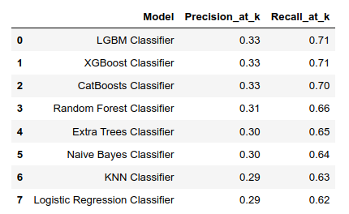 

As métricas utilizadas para avaliar a performances dos modelos foram:

* **Precision_at_k:** Precisão até o valor k (20 mil)
* **Recall_at_k:** Recall até o valor k (20 mil)

Os modelos com melhores performances foram LGBM Classifier, XGBoost Classifier e CatBoost Classifier.

O processo de validação cruzada do nosso problema de negócio dividiu o dataset de treino em 5 folds.

 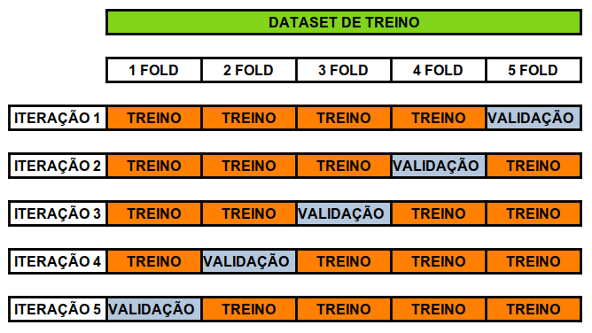 

Os modelos alcançaram as seguintes performances após o cross validation:

 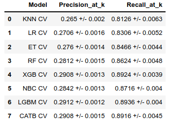 

O critério para analisar a performance geral dos modelos após o crosss validation foi calcular a médias e os desvios padrão dos resultados obtidos nos 5 folds.

O modelo que apresentou a melhor performance foi LGBM Classifier:
* precisão de 0.2912 +/- 0.0012.
* recall_at_k de 0.8936 +/- 0.0045.

### 5.2 Performance após Fine Tuning dos hiperparâmetros
O método utilizado para a realizar a otimização dos hiperparâmetros do modelo foi o random search. Os parâmetros utilizados foram:
* num_leaves
* max_depth
* min_split_gain
* subsample
* colsample_bytree

A performance após o Fine Tuning Hyperparameters apresentou os seguintes valores:

 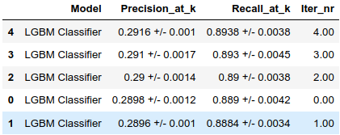 

A melhor performance foi com os seguintes parâmetros:
* num_leaves: 45
* max_depth: 5
* min_split_gain: 0.01
* subsample: 0.5
* colsample_bytree: 1

A precisão e o recall correspondem a:
* **precision:** 0.2916 +/- 0.001
* **recall:** 0.8938 +/- 0.0038

### 5.3 Business Performance

Um importante papel que o cientista de dados deve exercer é traduzir a performance obtida na modelagem de machine learning em resultados de negócios. A métrica Recall_at_K foi a balizadora para a construção do melhor ordenamento dos clientes com relação a maior probabilidade de responder sim para a variável resposta do problema.

**Aprendizagem do modelo**

O conjunto de dados de validação possui 75459 clientes (20% do dataset do hackthons).
* Sendo que 9328 responderam que tinha interesse em contratar o seguro veicular.

Lista ordenada pelo modelo de machine Learning até a posição 20 mil

 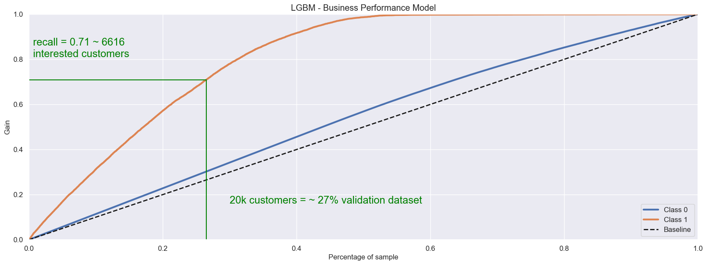 

* Rankeou 6616 clientes com interesse em contratar o seguro veicular dos 9328 clientes interessados existentes no conjunto de validação.
* Precisão de 33% (6616/20000)
* Recall 71% (6616/9328)

Probabilidade aleatória - modelo baseline

 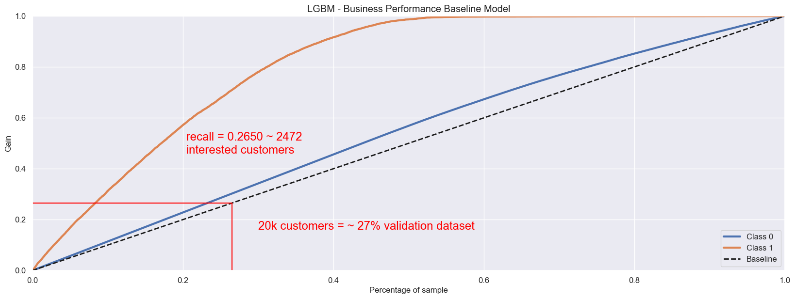 

* Clientes interessados 12,36% (9328/75459) do conjunto de dados de validação
* Valor esperado de clientes interessados até posição 20 mil = 2472 clientes (20000 * 12,36%)

Lift do modelo

 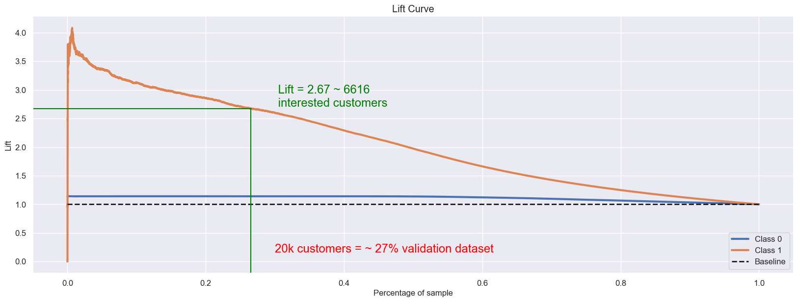 

* Modelo ordenou 6616 clientes interessados até a posição 20 mil
* Diferença de 4144 clientes a mais que o valor esperado do modelo aleatório até a posição 20 mil (6616-2472)
* Lift de 2.67 vezes que o modelo aleatório até a posição 20 mil (6616/2472)

  

**Generalização do Modelo**

O conjunto de dados de teste possui 38111 clientes (10% do dataset do hackthons).
* Sendo que 4783 responderam que tinha interesse em contratar o seguro veicular.

Lista ordenada pelo modelo de machine Learning até a posição 10100

* Rankeou 3411 clientes com interesse em contratar o seguro veicular dos 4783 clientes interessados existentes no conjunto de validação.
* Precisão de 33.77% (3411/10100)
* Recall 71.32% (3411/4783)

Probabilidade aleatória - modelo baseline

* Clientes interessados 12,55% (4783/38111) do conjunto de dados de validação
* Valor esperado de clientes interessados até posição 10100 mil = 1268 clientes (10100 * 12,55%)

Lift do modelo

* Modelo ordenou 3411 clientes interessados até a posição 10100.
* Diferença de 2143 clientes a mais que o valor esperado do modelo aleatório até a posição 10100 (3411-1268)
* Lift de 2.69 vezes que o modelo aleatório até a posição 10100 (3411/1268)

Ressalta-se que o poder de generalização do modelo aplicado ao dataset de teste está muito próximo do desempenho verificado no conjunto de validação.

**Lista Rankeada pelo modelo**

O conjunto de teste do hackthon promovido pela Analytics Vidhya e fornecido pela plataforma Kaggle dispõe de 127037 clientes, onde não há informações sobre a variável resposta do problema, que corresponderia a novos clientes da empresa.

Ressalta-se que implementamos o modelo nesse dataset e a lista ordenada dos "Id"' dos identificadores dos clientes e as suas respectivas probabilidades de responderem 1 ao interesse da contratação do seguro veicular se encontram no arquivo ["lista_ordenada.csv"](https://github.com/deivison1983/health_insurance_cross_sell/blob/main/dataset/lista_ordenada.csv) do presente repositório.

## 6 Conclusão do projeto de portfólio

Após todo o desenvolvimento desse primeiro ciclo desse projeto (CRISP-DM), o produto de dados propostos como solução do problema de negócio da Health Insurance India conseguiu alcançar o objetivo desejado. O modelo de machine learning mostrou-se capaz de rankear os clientes da base de acordo com as maiores probabilidades de responderem positivamente a proposta de seguro veicular. O produto de dado pode auxiliar o time comercial da Health Insurance India a abordar novos clientes de maneira mais assertiva dentro da capacidade operacional de 20 mil ligações por mês.

## 7 Próximos passos para melhorar os produtos

Após a primeira entrega é possível seguir por vários caminhos distintos nos próximos ciclos do CRISP-DM. Geralmente essa decisão poderá ser pautada por novas demandas vinda do CEO ou em função da motivação da equipe de ciência de dados.

Destacamos as seguintes possibilidades de caminhos:

* Retreinar o modelo com mais dados do dataset train.csv do Hackthon.

* Pesquisar novas variáveis macroeconômicas do setor que podem ser utilizadas para treinar o modelo e ampliar o conhecimento de negócio.

* Melhorar a performance do modelo através de um nova análise exploratória de dados.

* Testar outros modelos de machine learning com objetivo de melhorar a performance.

### Autor

Deivison Morais. Visite o meu portfólio de projetos [aqui.](https://deivison1983.github.io/portfolio_projetos/)

### Contatos

  
  

